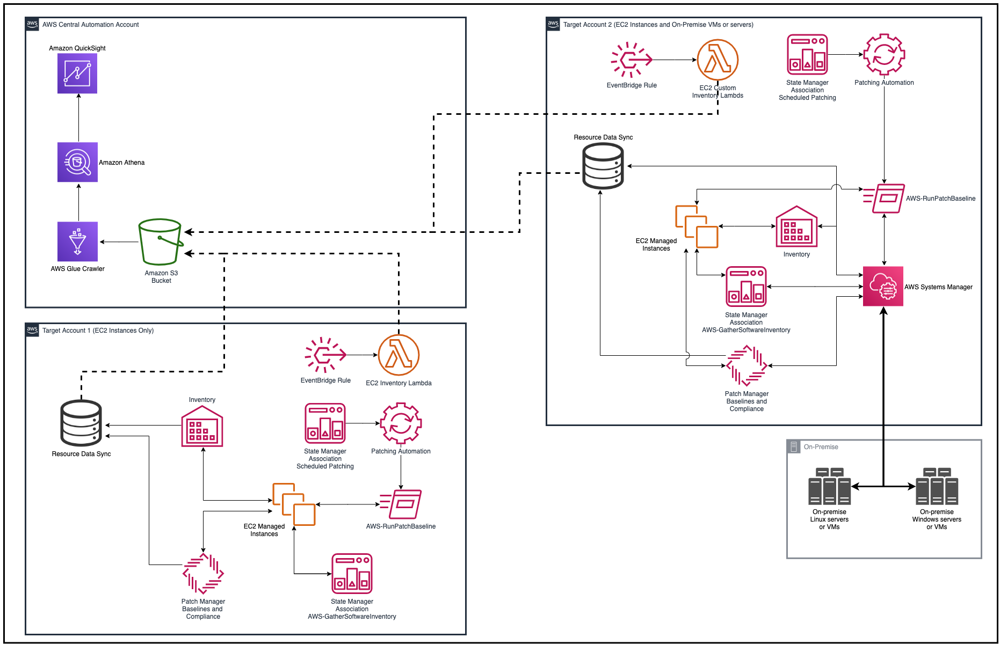
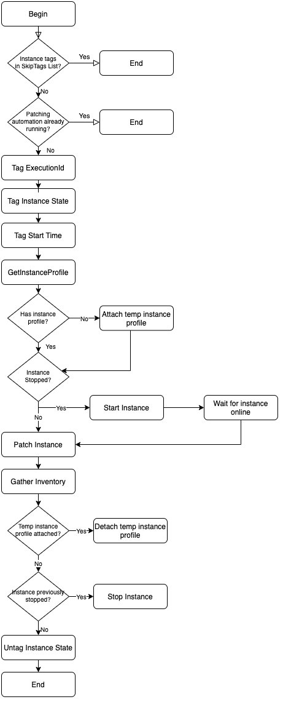
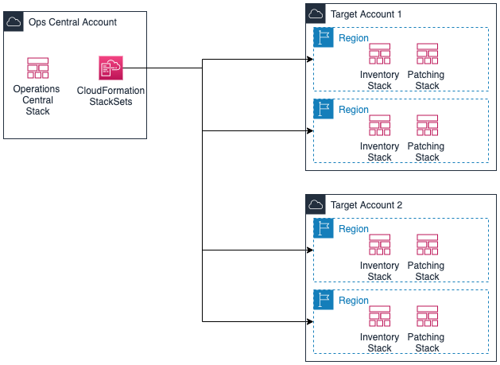

# Operational Management: Inventory, Patching, and Compliance

# Overview

The purpose of this series of CloudFormation templates is to setup a scheduled multi-account and multi-Region (MAMR) patching operation using Systems Manager. In addition to running patching commands on instances, the Systems Manager automation can temporarily any stopped stopped EC2 instances so they can be patched.`

Additionally, Systems Manager Inventory is enabled using a State Manager association. The patching, inventory, and compliance data gathered can then be queried and reported on using Amazon Athena or Amazon QuickSight.

# Table of Contents

- [Operational Management: Inventory, Patching, and Compliance](#operational-management-inventory-patching-and-compliance)
- [Overview](#overview)
- [Table of Contents](#table-of-contents)
- [Service Concepts](#service-concepts)
- [Architecture Diagram](#architecture-diagram)
  - [Resulting Environment](#resulting-environment)
    - [(Optional) Patch Microsoft Applications](#optional-patch-microsoft-applications)
  - [Architecture Details](#architecture-details)
    - [Scheduled Patching](#scheduled-patching)
    - [Patching Automation Workflow](#patching-automation-workflow)
    - [Inventory Data Gathering Process](#inventory-data-gathering-process)
  - [Architecture Notes](#architecture-notes)
- [Prerequisites](#prerequisites)
  - [Register your EC2 instance or on-premise hybrid instances](#register-your-ec2-instance-or-on-premise-hybrid-instances)
    - [Hybrid managed instances](#hybrid-managed-instances)
  - [Attach IAM policies to EC2 instance profiles for S3](#attach-iam-policies-to-ec2-instance-profiles-for-s3)
  - [(Optional) Create Patch Baselines and Patch Groups in accounts and regions](#optional-create-patch-baselines-and-patch-groups-in-accounts-and-regions)
- [Resources Created - Central Account](#resources-created---central-account)
    - [Resources created by opsmgmt-central-account.yaml](#resources-created-by-opsmgmt-central-accountyaml)
- [Resources Created - Target Account(s)](#resources-created---target-accounts)
    - [Resources created by opsmgmt-target-account-inventory.yaml](#resources-created-by-opsmgmt-target-account-inventoryyaml)
    - [Resources created by opsmgmt-target-account-patching.yaml](#resources-created-by-opsmgmt-target-account-patchingyaml)
- [Deployment Instructions](#deployment-instructions)
  - [Create the CloudFormation Stack in the Central Account](#create-the-cloudformation-stack-in-the-central-account)
    - [Deploy initial resources using opsmgmt-central-account.yaml](#deploy-initial-resources-using-opsmgmt-central-accountyaml)
  - [Create the Inventory and Patching CloudFormation StackSets in the Central or Management Account](#create-the-inventory-and-patching-cloudformation-stacksets-in-the-central-or-management-account)
  - [Deploy Inventory StackSet](#deploy-inventory-stackset)
  - [Deploy Patching StackSet](#deploy-patching-stackset)
  - [(Optional) Deploy test instances](#optional-deploy-test-instances)
    - [Resources Created](#resources-created)
    - [Instructions](#instructions)
- [Post-Deployment Instructions](#post-deployment-instructions)
  - [Run the AWS Glue Crawler](#run-the-aws-glue-crawler)
    - [(Optional) Verify the Database and Tables within AWS Glue](#optional-verify-the-database-and-tables-within-aws-glue)
  - [Use AWS Athena to query Inventory, Patching, and Compliance data](#use-aws-athena-to-query-inventory-patching-and-compliance-data)
- [Tear-Down Instructions](#tear-down-instructions)
  - [Remove resources from the Target Account(s)](#remove-resources-from-the-target-accounts)
  - [Remove resources from the Central Account](#remove-resources-from-the-central-account)
    - [Empty the S3 bucket](#empty-the-s3-bucket)
    - [Delete the Database and Tables in AWS Glue](#delete-the-database-and-tables-in-aws-glue)
    - [Remove the CloudFormation stack and StackSet in the Central account](#remove-the-cloudformation-stack-and-stackset-in-the-central-account)
- [Related References](#related-references)
    - [AWS Blogs:](#aws-blogs)
    - [User Guide Documentation:](#user-guide-documentation)
    - [Pricing:](#pricing)
- [Change Log](#change-log)
- [Example IAM Policies and Trust Relationships](#example-iam-policies-and-trust-relationships)
      - [Automation Administration role](#automation-administration-role)
      - [Automation Execution role](#automation-execution-role)
      - [Glue Crawler role](#glue-crawler-role)
      - [EC2 Instance IAM profile role](#ec2-instance-iam-profile-role)

# Service Concepts

In this section, we take a closer look at the following concepts of AWS Systems Manager and AWS Glue.

| Service | Term | Definition |
| --- | --- | --- |
| AWS Systems Manager | Automation Document | A Systems Manager **automation document**, or playbook, defines the Automation workflow (the actions that Systems Manager performs on your managed instances and AWS resources). Automation includes several pre-defined Automation documents that you can use to perform common tasks like restarting one or more Amazon EC2 instances or creating an Amazon Machine Image (AMI). You can create your own Automation documents as well. Documents use JavaScript Object Notation (JSON) or YAML, and they include steps and parameters that you specify. For more information, see [Working with Automation Documents (Playbooks)](https://docs.aws.amazon.com/systems-manager/latest/userguide/automation-documents.html). |
| AWS Systems Manager | Automation Execution Role | This role gives Systems Manager permission to perform actions on your behalf. The CloudFormation template in this solution provisions role used to execute the Automation in each region.  |
| AWS Systems Manager | Resource Data Sync | You can use Systems Manager **resource data sync** to send inventory data collected from all of your managed instances to a single Amazon S3 bucket. Resource data sync then automatically updates the centralized data when new inventory data is collected. For more information, see [Configuring Resource Data Sync for Inventory](https://docs.aws.amazon.com/systems-manager/latest/userguide/sysman-inventory-datasync.html). |
| AWS Systems Manager | Patch Baseline | A **patch baseline** defines which patches are approved for installation on your instances. You can specify approved or rejected patches one by one. You can also create auto-approval rules to specify that certain types of updates (for example, critical updates) should be automatically approved. The rejected list overrides both the rules and the approve list. For more information, see [About Predefined and Custom Patch Baselines](https://docs.aws.amazon.com/systems-manager/latest/userguide/sysman-patch-baselines.html). T**he CloudFormation template in this solution creates a custom patch baseline for each supported OS and automatically sets it as the default patch baseline.** You may wish to customize this or define your own baselines and patch groups in each account separately. |
| AWS Systems Manager | Patch Group | You can use a **patch group** to associate instances with a specific patch baseline. Patch groups help ensure that you are deploying the appropriate patches, based on the associated patch baseline rules, to the correct set of instances. Patch groups can also help you avoid deploying patches before they have been adequately tested. For example, you can create patch groups for different environments (such as Development, Test, and Production) and register each patch group to an appropriate patch baseline. **Note**: A managed instance can only be in one patch group. You create a patch group by using Amazon EC2 tags or Systems Manager resource tags. Unlike other tagging scenarios across Systems Manager, a patch group **must** be defined with the tag key: **Patch Group**. Note that the key is case-sensitive. You can specify any value, for example ```web servers``` but the key must be **Patch Group**.For more information, see [About Patch Groups](https://docs.aws.amazon.com/systems-manager/latest/userguide/sysman-patch-patchgroups.html). **NOTE: The Cloudformation Templates in this solution DO NOT define any patch groups. You may wish to customize these templates or setup patch groups in your accounts separately. Otherwise, instances will use the default patch baselines as mentioned above.**|
| AWS Systems Manager | Activation Code | To set up servers and virtual machines (VMs) in your hybrid environment as managed instances, you need to create a managed-instance **activation**. After you successfully complete the activation, you immediately receive an **Activation Code** and **Activation ID**. You specify this Code/ID combination when you install SSM Agent on servers and VMs in your hybrid environment. The Code/ID provides secure access to the Systems Manager service from your managed instances. For more information, see [Setting Up AWS Systems Manager for Hybrid Environments](https://docs.aws.amazon.com/systems-manager/latest/userguide/systems-manager-managedinstances.html). If you are not managing VMs outside AWS, activation codes are not needed. |
| AWS Glue | Crawler | A **crawler** accesses your data store, extracts metadata, and creates table definitions in the AWS Glue Data Catalog.For more information, see [Working with Crawlers on the AWS Glue Console](https://docs.aws.amazon.com/glue/latest/dg/console-crawlers.html). The CloudFormation templates in this solution will create a Glue crawler that indexes aggregated inventory data stored in S3. |

# Architecture Diagram



## Resulting Environment

After deploying the `opsmgmt-central-account.yaml` CloudFormation template in the central account, you will have an central account where inventory data is aggregated, as well as a Glue crawler that index inventory data so that it be queries in Athena. 

Deploying the `opsmgmt-target-account-inventory,yml` template into target accounts and regions will setup a Resource Data Sync that sends instance inventory data to the S3 bucket in the central account. A State Manager Association will be created to gather software inventory data (applications installed, AWS components, network configuration, etc.). Compliance data will be reported based on the success of gathering of inventory data (Compliant if the operation completed successfully or non-compliant if the resource did not gather inventory successfully). Additionally, Event Bridge rules invoke a Lambda function that gathers EC2 instance information and writes it to a `Custom` location in the resource data sync bucket of the target account. This captures both managed and unmanaged EC2 instances, which is useful for identifying instances that aren't managed by Systems Manager as well as getting the instance status (i.e. running, stopped)

Deploying the `opsmgmt-target-account-patching.yaml` template into target accounts and regions will setup default patch baselines for each operating system (these could be customized) and a Systems Manager Automation Document that performs instance patching. The Automation Document will, optionally, automatically start stopped instances, patch them, and then stop them again. Finally, a State Manager Association is created that, by default, executions the patching automation on all instances in the account every Saturday at 11:59 PM. 

During the patching operation, the managed instance will scan (or install) patches based on the patch baseline approval rules. For more information, see [About Predefined and Custom Patch Baselines](https://docs.aws.amazon.com/systems-manager/latest/userguide/sysman-patch-baselines.html) and [About Patch Groups](https://docs.aws.amazon.com/systems-manager/latest/userguide/sysman-patch-patchgroups.html). To create a custom patch baseline, see [Create a Custom Patch Baseline](https://docs.aws.amazon.com/systems-manager/latest/userguide/sysman-patch-baseline-console.html).

The patching data, inventory data, and resulting compliance data will all be aggregated centralized S3 bucket via a Resource Data Sync created in each target account. You can then use AWS Glue, Amazon Athena, and Amazon QuickSight to report and visualize this data across your environment.

### (Optional) Patch Microsoft Applications

_Note: If you do not intend on patching Microsoft Applications (e.g. Microsoft Office, Microsoft Active Directory, or Microsoft SQL) then you can skip this section._

You can configure Patch Baselines to select and apply Microsoft application patches automatically across your Amazon EC2 or on-premises instances. All application patches available in the Microsoft update catalog are supported. For more information, see [About Patching Applications on Windows Server](https://docs.aws.amazon.com/systems-manager/latest/userguide/about-windows-app-patching.html).

**TODO**: Add this as an optional parameter to the template

**Important**: Microsoft application patching is available at no additional charge for EC2 instances and incurs a charge as part of the On-Premises Instance Management advanced tier when used on premises; see the [pricing page](https://aws.amazon.com/systems-manager/pricing/) for details.

## Architecture Details

### Scheduled Patching
1. The `opsmgmt-target-account-patching.yaml` template creates a State Manager Association in each account and region that it is deployed in. The association targets all systems in the account and region.
2. The State Manager Association is configured by default to execute the patching automation document Saturday at 11:59pm on all targeted instances. This can be adjusted by modifying the cron statement when deploying the template.
3. The automation document runs against each instance in the account.

### Patching Automation Workflow


**Note:** This diagram does not depict all individual steps in the automation.

For each targeted instance, the automation document performs the following steps:
1. The automation checks if any instance tags match tag key/value pairs in the `SkipTags` parameter passed to the document. If they do, the automation exits and returns success for that instance.
2. The automation checks if an execution is already running on the instance - this is unlikely to happen but if it did it could create conflicts. If the there is already an execution for the instance, the automation exits.
3. Three tags are written to the instance: 
   * `InstancePatchingLastBeginTime`: The current timestamp
   * `InstancePatchingBeginState`: The state of the instance when the automation document began (`stopped` or `running`)
   * `InstancePatchingLastExecutionId`: The Execution Id of the automation.

    These tags are used for tracking the patching process and validating the workflow completed successfully and the instance has returned to its previous state (`stopped` or `running`) after patching.

4. If the instance has no profile (IAM role) attached, the automation will (optionally) attach a temporarily instance profile that enables Systems Manager to run commands on the instance and send execution logs to the central S3 bucket. 
5. If the instance is in a stopped state, the automation will (optionally) start the instance and wait for it to check in (online status) with Systems Manager.
6. The workflow patches the instance using the Run Command document ```AWS-RunPatchBaseline``` with the operation specified from the execution parameters (`Scan` or `Install`)
7. Results from the Run Command task are sent to the centralized S3 bucket. Patch Compliance data is reported to Patch Manager.
8. The workflow (optionally) performs an inventory on the instance by creating a temporary State Manager association that executes the `AWS-GatherSoftwareInventory` policy document on the instance. Inventory data is written to Systems Manager Inventory within the region.
  **Note**: It is recommended that you create State Manager Association for `AWS-GatherSoftwareInventory` in the account to target all instances instead. The approach of creating a temporary association that this workflow uses can affect what inventory data is displayed within the *Inventory* section of the Systems Manager console within the account and region. 
9.  The workflow checks if the instance was stopped at the beginning of the workflow. If so, it proceeds to stop the instance. 
  **Important:** The workflow has no way to determine if the instance enters active use during the patching. It is assumed that the workflow will run during a maintenance Window where the instance will not be in use. 

10. The tags `InstancePatchingBeginState` and `InstancePatchingLastExecutionId` are removed to indicate the workflow completed. 

### Inventory Data Gathering Process

1. A State Manager Association in each account and region triggers using the rate of 1 day to gather software inventory data. This association is independent of the patching association and workflow.
2. The Inventory data is reported to Systems Manager.
3. The Resource Data Sync takes the Inventory data and outputs to the centralized S3 bucket.

## Architecture Notes

- The Inventory execution logs will be segmented by account ID and region. For example:

```ssm-execution-logs-us-east-1-123456789012/inventory-execution-logs/accountid=123456789012/region=us-east-1/i-1234567890EXAMPLE/.../stdout```

- The full output results of the ```AWS-RunPatchBaseline``` operation can be located in the central S3 bucket under the prefix patching. This is then segmented by account ID and region. For example:

```ssm-execution-logs-us-east-1-123456789012/patching/accountid=123456789012/region=us-east-1/executionid={{automation:EXECUTION_ID}}/<run-command-id>…/stdout```

- The State Manager Association for ```AWS-GatherSoftwareInventory``` is configured to run once a day and gathers the default Inventory parameters. For more information, see [Metadata Collected by Inventory](https://docs.aws.amazon.com/systems-manager/latest/userguide/sysman-inventory-schema.html).

- The Glue Crawler is configured to run once a day at 00:00 UTC.

# Prerequisites

## Register your EC2 instance or on-premise hybrid instances

For more information, see [Setting Up AWS Systems Manager](https://docs.aws.amazon.com/systems-manager/latest/userguide/systems-manager-setting-up.html) and [Setting Up AWS Systems Manager for Hybrid Environments](https://docs.aws.amazon.com/systems-manager/latest/userguide/systems-manager-managedinstances.html).

  **Note:** Attaching an instance profile and role with Systems Manager policies attached is a prerequisite for managing EC2 instances with Systems Manager. For EC2 instances that do not currently have an instance profile attached, the patching automation document can attach a *temporary* instance role/profile with Systems Manager permissions to EC2 instances that do not have one. However, there are limitations to this approach:
  
  - It will not override an instance profile already attached to an EC2 instance.
  - Running EC2 instances may not immediately check in with Systems Manager after the temporary profile is attached. In some cases, this can take hours to occur.
  - Instance profile attachment is not applicable to hybrid managed instances
  
  Therefore, it is **strongly recommended** you configure and attach IAM instance profiles, roles, and policies for Systems Manager to instances prior for reliable patching, inventory, and management. If you need automate EC2 instance registration with Systems Manager across your AWS accounts and regions, consider using an [Organization Quick Setup](https://docs.aws.amazon.com/systems-manager/latest/userguide/systems-manager-quick-setup.html). Organization Quick Setup will create automation documents and State Manager associations in each account to automatically attach instance profiles to EC2 instances and (optionally) attach Systems Manager IAM policies to existing instances.

  ### Hybrid managed instances
  If applicable, you have registered your on-premise VMs and servers to Systems Manager. For more information, see [Setting Up AWS Systems Manager for Hybrid Environments](https://docs.aws.amazon.com/systems-manager/latest/userguide/systems-manager-managedinstances.html).

## Attach IAM policies to EC2 instance profiles for S3

For your EC2 instances or if you are using hybrid managed instances (```mi-*```), if you wish to send execution logs to the execution logs bucket in the central account for auditing and analysis, you must grant S3 permissions to the central S3 bucket in order to export patching and Inventory execution logs. For more information, see [Step 2: Create an IAM Service Role for a Hybrid Environment](https://docs.aws.amazon.com/systems-manager/latest/userguide/sysman-service-role.html).

    An example IAM policy snippet is as follows (you must replace the S3 ARN with the ARN of the S3 bucket created by the Central account CFN template):

    ```json
    {
        "Effect": "Allow",
        "Action": [
            "s3:GetObject",
            "s3:PutObject",
            "s3:PutObjectAcl"
        ],
        "Resource": [
            "arn:aws:s3:::ssm-execution-logs-us-east-1-123456789012",
            "arn:aws:s3:::ssm-execution-logs-us-east-1-123456789012/*"
        ]
    }
    ```

## (Optional) Create Patch Baselines and Patch Groups in accounts and regions
You create patch baselines with the appropriate approval rules and exceptions. For more information, see [About Predefined and Custom Patch Baselines](https://docs.aws.amazon.com/systems-manager/latest/userguide/sysman-patch-baselines.html). To create a custom patch baseline, see [Create a Custom Patch Baseline](https://docs.aws.amazon.com/systems-manager/latest/userguide/sysman-patch-baseline-console.html). You can also create [Patch Groups](https://docs.aws.amazon.com/systems-manager/latest/userguide/sysman-patch-patchgroups.html) in each AWS account and region for targeting specific baselines at sets of instances (i.e. by instance tag). 

If you do not create custom patch baselines, instances will apply the default patch baselines in the account. The Automation can optionally create and deploy these default patch baselines. To customize the default patch baselines for your needs, you can modify the `opsmgt-target-accounts-patching.yaml` template. 

# Resources Created - Central Account

### Resources created by opsmgmt-central-account.yaml

Amazon S3 Resources:

- ResourceSyncBucket: S3 Bucket for Resource Data Sync to gather Systems Manager Inventory, Patching, and Compliance data across accounts and regions. Example name: ```ssm-resource-sync-us-east-1-123456789012```
- ResourceSyncBucketPolicy: S3 Bucket Policy for Resource Data Sync bucket to permit Systems Manager access across organization
- ExecutionLogsBucket: S3 Bucket for execution logs to store execution logs generated by patching and inventory data gathering operations across accounts and regions. Example name: ```ssm-execution-logs-us-east-1-123456789012```
- ExecutionLogsBucketPolicy: S3 Bucket Policy to permit access across organization
- AthenaQueryResultsBucket: S3 Bucket to store Athena query details

AWS KMS Resources:

- ManagedInstanceDataEncryptionKey: KMS key used to encrypt instance data
- ManagedInstanceDataEncryptionKeyAlias: KMS key alias

AWS Lambda Resources:

- DeleteGlueTableColumnFunctionRole: IAM Service Role for Lambda to remediate Glue table
- DeleteGlueTableColumnFunction: Lambda Function to remediate Glue table

AWS Systems Manager Resources:

- AutomationAdministrationServiceRole: Automation Administration IAM Service Role

Amazon CloudWatch Resources:

- DeleteGlueTableColumnFunctionEventRule: CloudWatch Event Rule to invoke Lambda function following successful Glue Crawler execution
- DeleteGlueTableColumnFunctionCloudWatchPermission: Permissions for CloudWatch Event initiate the Lambda function

AWS Glue Resources:

- GlueDatabase: Glue Database for resource data sync data
- GlueCrawler: Crawler to tables within the database
- GlueCrawlerRole: IAM Service Role for AWS Glue

Amazon Athena Resources:

- Four example Athena named queries:
  - AthenaQueryNonCompliantPatch: List managed instances that are non-compliant for patching
  - AthenaQuerySSMAgent: List SSM Agent versions installed on managed instances
  - AthenaQueryInstanceList: List non-terminated instances
  - AthenaQueryInstanceApplications: List applications for non-terminated instances

# Resources Created - Target Account(s)

### Resources created by opsmgmt-target-account-inventory.yaml

**Note**: You can optionally choose to provide an existing IAM role for the Automation Execution role. To confirm this role is configured appropriately, see [Example IAM Policies and Trust Relationships](#example-iam-policies-and-trust-relationships).

AWS Systems Manager Resources:

- ResourceDataSync: Resource Data Sync
- InventoryAssociation: State Manager Association for ```AWS-GatherSoftwareInventory```
- EC2 Custom Inventory Lambda Function: Collects details of EC2 instances ans writes them to the same S3 bucket as Resource Data Sync. 
- EventBridge Rules: One rule runs every 6 hours. Another rule runs on instance state change (i.e. stopped, running, terminated). Both rules invoke the EC2 Custom Inventory Lambda Function

### Resources created by opsmgmt-target-account-patching.yaml

**Note**: You can optionally choose to provide an existing IAM role for the Automation Execution role. To confirm this role is configured appropriately, see [Example IAM Policies and Trust Relationships](#example-iam-policies-and-trust-relationships).

AWS Systems Manager Resources:

- AutomationExecutionServiceRole: Automation Execution IAM Service Role used to execute the patching automation.
- An automation document used for patching.
- A State Manager Association that executes the patching automation document on a schedule.
- Patch baselines for each supported operating system. Each baselines is configured to install all security patches with an approval time of 0 days. This can be customized if desired.
- A Lambda-backed custom resource that will configure the patch baselines as the default baselines in the AWS account and region. If the stack is deleted, the custom resource will automatically set the default baselines to the AWS-provided ones.

# Deployment Instructions



In an AWS account designated for central operations, the `opsmgt-operations-central-account.yaml` template will be deployed. 

It is highly recommended that CloudFormation StackSets are used to deploy the `opsmgmt-target-account-inventory.yaml` and `opsmgmt-target-account-patching.yaml` templates to target AWS accounts and regions. 

If you are using AWS Organizations, you can simplify IAM permissions needed to deploy StackSets to other accounts by enabling the [StackSets with service-managed permissions](https://docs.aws.amazon.com/AWSCloudFormation/latest/UserGuide/stacksets-orgs-enable-trusted-access.html). You can also delegate permission to deploy StackSets to an account that *is not* the Management account using [StackSets Delegated Administrator](https://docs.aws.amazon.com/AWSCloudFormation/latest/UserGuide/stacksets-orgs-delegated-admin.html)


## Create the CloudFormation Stack in the Central Account

### Deploy initial resources using opsmgmt-central-account.yaml

**Note:** This template is deployed as a stack in the central account, *not* as a StackSet. 

1. Open the [CloudFormation console](https://console.aws.amazon.com/cloudformation/)
1. Select **Create stack** and then **With new resources (standard)**.
1. Choose **Upload a template file** and select ```opsmgmt-central-account.yaml``` from your local machine.
1. Choose **Next**.
1. Enter a stack name.
1. For the **Parameters** section, enter the following information:
   1. For **Organization ID**, enter the Organization ID to be used for S3 bucket sharing.
   1. For **Tag Name**, enter the tag name used for resources.
   1. For **Tag Value**, enter the tag value used for resources.

1. Choose **Next**.
1. Choose **Next**.
1. Select **I acknowledge that AWS CloudFormation might create IAM resources with custom names**.
1. Choose **Create stack**.


## Create the Inventory and Patching CloudFormation StackSets in the Central or Management Account

## Deploy Inventory StackSet

1. Open the [CloudFormation console](https://console.aws.amazon.com/cloudformation/) in the central account.
1. From the left navigation pane, choose **StackSets**, and then choose **Create StackSet**.
1. Select **Create StackSet**.
1. Choose **Upload a template file** and select ```opsmgmt-target-account-inventory.yaml``` from your local machine.
1. Choose **Next**.
1. Enter a StackSet name.
1. For the **Parameters** section, enter the following information:
   1. For **ExecutionLogsS3Bucket**, enter the name of the execution logs S3 bucket created in the central account. The S3 bucket name can be found in the Output tab of the CloudFormation stack in the central account created using the ```opsmgmt-central-account.yaml``` template. The S3 bucket name will follow the format of ssm-execution-logs-region-account-id. For example:
   ```ssm-execution-logs-us-east-1-123456789012```
   1. For **ExecutionLogsS3BucketPrefix**, optionally modify the S3 bucket prefix for the Inventory execution logs.
   2. For **ExistingAutomationExecutionRole**, optionally enter the ARN of the IAM role that is configured as an execution role for multi-account and multi-Region Automation workflows. **Important**: The name of the IAM role must match the ExecutionRoleName provided in the management account.
   3. For **ManagedInstanceDataEncryptionKey**, enter the ARN of the KMS key used to encrypt S3 bucket logs. The KMS key ARN can be found in the Output tab of the CloudFormation stack in the central account created using the ```opsmgmt-central-account.yaml``` template. An example KMS key ARN is as follows:
   ```arn:aws:kms:us-east-1:123456789012:key/1234abcd-12ab-34cd-56ef-1234567890ab```
   1. For **ResourceDataSyncName**, optionally modify the name used for the Resource Data Sync.
   2. For **ResourceSyncS3Bucket**, enter the name of the Resource Data Sync S3 bucket that lives in the central account. The S3 bucket name can be found in the Output tab of the CloudFormation stack in the central account created using the ```opsmgmt-central-account.yaml``` template. The S3 bucket name will follow the format of ssm-resource-sync-region-account-id. For example:
   ```ssm-resource-sync-us-east-1-123456789012```
   1. For **ResourceSyncS3BucketRegion**, enter the region where the central account S3 bucket is created.

1. Choose **Next**.
1. On the **Configure StackSet options** page, add any required tags. The content of the **Permissions** section varies, depending on whether you have AWS Organizations enabled: 
   1. If you do not have AWS Organizations enabled, choose **Self service permissions**, and then choose **Next**.
   1. If you have AWS Organizations enabled, you can choose **Service managed permissions** to apply the StackSets to an organization or OU. For demonstration purposes, this walkthrough will use the **Service managed permissions**, subsequent steps may differ if you choose **Self service permissions**. Choose **Next**.
1. In the **Set deployment options** page, choose **Deploy to organization units (OUs)** and enter the AWS OU ID where you want to deploy the stackSet.
  **IMPORTANT**: It is highly recommended that you test the inventory and patching scripts on a small set of accounts before deploying to larger OUs or across the entire organization. Once initial testing has been done, the StackSets can be updated to change OU, account, and region targeting.
1. Optionally modify the **Automatic deployment** and **Account removal behavior** options. If you wish to automatically deploy the template to new accounts that join the OU or organization, enable automatic deployment.
2. In the **Specify regions** section, choose the region in which you want to deploy stacks. 
3. In the **Deployment options** section, optionally modify the values for **Maximum concurrent accounts** and **Failure tolerance**. When deploying to a large number of accounts and regions, set these values higher to deploy the stacks faster and continue if some accounts or regions encounter errors.

1. Choose **Next**.
1. Select **I acknowledge that AWS CloudFormation might create IAM resources with custom names**.
1. Choose **Submit**.

The StackSet creation process for the target accounts will take some time. Once the status of the StackSet changes to ```ACTIVE``` and the status of each stack instances changes to ```CURRENT```, proceed with the next section.

## Deploy Patching StackSet

1. Open the [CloudFormation console](https://console.aws.amazon.com/cloudformation/) in the central account.
1. From the left navigation pane, choose **StackSets**, and then choose **Create StackSet**.
1. Select **Create StackSet**.
1. Choose **Upload a template file** and select ```opsmgmt-target-account-patching.yaml``` from your local machine.
1. Choose **Next**.
1. Enter a StackSet name.
1. For the **Parameters** section, enter the following information:
   1. For **ExecutionLogsS3Bucket**, enter the name of the execution logs S3 bucket created in the central account. The S3 bucket name can be found in the Output tab of the CloudFormation stack in the central account created using the ```opsmgmt-central-account.yaml``` template. The S3 bucket name will follow the format of ssm-execution-logs-region-account-id. For example:
   ```ssm-execution-logs-us-east-1-123456789012```
   1. For **PatchingExecutionLogsS3BucketPrefix**, optionally modify the S3 bucket prefix for the Patching execution logs.
   1. For **InventoryExecutionLogsS3BucketPrefix**, optionally modify the S3 bucket prefix for the Inventory execution logs.
   1. Configure the rest of the parameters in the template, according to their descriptions. 
1. Choose **Next**.
1. On the **Configure StackSet options** page, add any required tags. The content of the **Permissions** section varies, depending on whether you have AWS Organizations enabled: 
   1. If you do not have AWS Organizations enabled, choose **Self service permissions**, and then choose **Next**.
   2. If you have AWS Organizations enabled, you can choose **Service managed permissions** to apply the StackSets to an organization or OU. For demonstration purposes, this walkthrough will use the **Service managed permissions**, subsequent steps may differ if you choose **Self service permissions**. Choose **Next**.
1. In the **Set deployment options** page, choose **Deploy to organization units (OUs)** and enter the AWS OU ID where you want to deploy the stackSet.

    **IMPORTANT**: It is highly recommended that you test the inventory and patching scripts on a small set of accounts before deploying to larger OUs or across the entire organization. Once initial testing has been done, the StackSets can be updated to change OU, account, and region targeting.
5. Optionally modify the **Automatic deployment** and **Account removal behavior** options. If you wish to automatically deploy the template to new accounts that join the OU or organization, enable automatic deployment.
6. In the **Specify regions** section, choose the region in which you want to deploy stacks. 
7. In the **Deployment options** section, optionally modify the values for **Maximum concurrent accounts** and **Failure tolerance**. When deploying to a large number of accounts and regions, set these values higher to deploy the stacks faster and continue if some accounts or regions encounter errors.

1. Choose **Next**.
1. Select **I acknowledge that AWS CloudFormation might create IAM resources with custom names**.
1. Choose **Submit**.

The StackSet creation process for the target accounts will take some time. Once the status of the StackSet changes to ```ACTIVE``` and the status of each stack instances changes to ```CURRENT```, proceed with the next section.

## (Optional) Deploy test instances

Optionally, you can use the following instructions to deploy two test EC2 instances which have the tag key-value pair ```Patch:True``` and are joined to the Resource Group ```WebServers```. If you chose to target a different tag key-value pair, then you will need to modify the template below to use that tag. The template will launch one Amazon Linux instance and one Windows 2019 instance.

### Resources Created

- (Optionally) IAM Instance Profile role for Systems Manager
- VPC, subnet, route table, network ACL, security group, Internet Gateway
- Resource Group named ```WebServers```
- t2.small Amazon Linux instance
- t2.small Windows 2019 instance

### Instructions

1. Open the [CloudFormation console](https://console.aws.amazon.com/cloudformation/)
1. Select **Create stack** and then **With new resources (standard)**.
1. Choose **Upload a template file** and select ```opsmgmt-deploy-test-instances.yaml``` from your local machine.
1. Choose **Next**.
1. Enter a stack name.
1. For the **Parameters** section, enter the following information:
   1. For **ExecutionLogsS3Bucket**, enter the name of the execution logs S3 bucket created in the central account. The S3 bucket name can be found in the Resources tab of the CloudFormation stack in the central account. The S3 bucket name will follow the format of ```ssm-execution-logs-region-account-id```. For example: ```ssm-execution-logs-us-east-1-012345678901```
   1. For **ExistingManagedInstanceProfile**, enter the name of an existing IAM Instance Profile that is configured for Systems Manager. For example, ```ManagedInstanceProfile```.
1. Choose **Next.**
1. Choose **Next**.
1. Choose **Create stack**.

Repeat the above process to deploy instances to multiple accounts and Regions. **Important:** If you deploy to multiple regions within the same account, then you must provide IAM Instance Profile value for **ExistingManagedInstanceProfile**.

# Post-Deployment Instructions

## Run the AWS Glue Crawler

**Note**: Inventory data is gathered immediately for matching managed instances. Patch data (and the resulting compliance data specific to patching) will be gathered following the first invocation of the CloudWatch Event which is based on the schedule specified when creating the CloudFormation stack.

The AWS Glue Crawler is configured to run once a day. The first run will occur on the next occurrence of 00:00 UTC following the creation of the CloudFormation stack. If you would like to review data within Athena prior to this time, you must manually run the Glue Crawler.

1. In the central account, open the [AWS Glue console](https://console.aws.amazon.com/glue/home).
1. Select **Crawlers** in the left-hand navigation pane.
1. Select the Glue Crawler created by the Central CloudFormation template. The name is ```SSM-GlueCrawler```
1. Select **Run crawler**.

The Crawler should run for approximately 2-4 minutes before stopping. Once the Crawler has returned to the ```Ready``` state, verify that tables were added to the resulting database. 

**Note**: 14 tables are added following successful patch scanning (or installing) process and Inventory data gathering process. If your CloudWatch Event rule has not executed yet, then you may have fewer tables added. Following a patching operation and the next execution of the Crawler, additional tables will be created automatically.

### (Optional) Verify the Database and Tables within AWS Glue

Following the successful run of the Crawler in the previous section, you can optionally choose to review the database and tables created.

1. In the central account, open the [AWS Glue console](https://console.aws.amazon.com/glue/home).
1. Select **Databases**, in the left-hand navigation pane.
1. Select the database created by the Crawler. The name should be similar to:
   
   ```ssm_global_resource_sync```
1. Select the option to review the tables for this specific database. The link is similar to the following:
   
   ```Tables in ssm_global_resource_sync```
1. Optionally, select a table to review additional details, such as the table properties, schema, and partitions.


## Use AWS Athena to query Inventory, Patching, and Compliance data

1. In the Central Account, open the [AWS Athena console](https://console.aws.amazon.com/athena/home).
1. Select **Saved Queries**.
1. Select the named query that you want to run.
   - **QueryNonCompliantPatch** - List managed instances that are non-compliant for patching.
   - **QuerySSMAgentVersion** - List SSM Agent versions installed on managed instances.
   - **QueryInstanceList** - List non-terminated instances.
   - **QueryInstanceApplications** - List applications for non-terminated instances.
1. After selecting a named query, ensure the ```ssm_global_resource_sync``` database is selected.
1. Next, select **Run query** and view the results.
1. Optionally, select the **History** tab and select **Download results** to receive a CSV formatted output of the results.

# Tear-Down Instructions

## Remove resources from the Target Account(s)

1. In each Target account, open the [CloudFormation console](https://console.aws.amazon.com/cloudformation/).
1. If you followed the section [(Optional) Deploy test instances](#optional-deploy-test-instances), then first remove the CloudFormation stack(s) deployed.
1. Select **Delete**.
1. Select **Delete stack**.

## Remove resources from the Central Account

### Empty the S3 bucket

In order to remove the CloudFormation stack in the central account, you must first empty the S3 bucket created.

**Warning:** Following the below process will delete all inventory, patching, and compliance related data in the central S3 bucket.

1. In the Central account, open the [S3 console](https://s3.console.aws.amazon.com/s3/).
1. Open the bucket created in the section [Create the CloudFormation Stacks in the Central Account](#create-the-cloudformation-stack-in-the-central-account).
1. Select each prefix created (e.g. inventory-execution-logs, inventory, and patching).
1. Select **Actions** and then **Delete**.
1. Select **Delete**.

### Delete the Database and Tables in AWS Glue

1. In the central account, open the [AWS Glue console](https://console.aws.amazon.com/glue/home).
1. Select **Databases** in the left-hand navigation pane.
1. Select the database created by the Crawler. The name should be similar to:

   ```systems-manager-us-east-1-123456789012-database```
1. Choose **Action** and then **Delete database**.
1. Choose **Delete**.

### Remove the CloudFormation stack and StackSet in the Central account

1. In the Central account, open the [CloudFormation console](https://console.aws.amazon.com/cloudformation/).
1. Select the CloudFormation stack created in the section [Create the CloudFormation Stacks in the Central Account](#create-the-cloudformation-stack-in-the-central-account).
1. Select **Delete**.
1. Select **Delete stack**.

# Related References

### AWS Blogs:

[Centralized multi-account and multi-Region patching with AWS Systems Manager Automation](https://aws.amazon.com/blogs/mt/centralized-multi-account-and-multi-region-patching-with-aws-systems-manager-automation/)

[Understanding AWS Systems Manager Inventory Metadata](https://aws.amazon.com/blogs/mt/understanding-aws-systems-manager-inventory-metadata/)

### User Guide Documentation:

[About the SSM Document AWS-RunPatchBaseline](https://docs.aws.amazon.com/systems-manager/latest/userguide/patch-manager-about-aws-runpatchbaseline.html)

[Recording Software Configuration for Managed Instances](https://docs.aws.amazon.com/config/latest/developerguide/recording-managed-instance-inventory.html)

### Pricing:

[AWS Systems Manager Pricing](https://aws.amazon.com/systems-manager/pricing/)

[AWS Glue Pricing](https://aws.amazon.com/glue/pricing/)

[Amazon Athena Pricing](https://aws.amazon.com/athena/pricing/)

[Amazon S3 Pricing](https://aws.amazon.com/s3/pricing/)

[Amazon CloudWatch Pricing](https://aws.amazon.com/cloudwatch/pricing/)

# Change Log

Change  | Description | Date
------------- | -------------
Package is live  | The first release of the package has been made available publicly. | 2020-12-17

# Example IAM Policies and Trust Relationships

The following section provides example IAM policies that you can attach to IAM roles and their associated Trust Relationships if you have elected to leverage existing IAM roles for the Automation Administration role, Automation Execution role, Lambda function role, Glue Crawler role, or the EC2 Instance IAM profile role.

#### Automation Administration role
<details>
<summary>IAM Permissions policy: AssumeRole-AWSSystemsManagerAutomationExecutionRole</summary><p>

```
{
    "Version": "2012-10-17",
    "Statement": [
        {
            "Action": [
                "sts:AssumeRole"
            ],
            "Resource": "arn:aws:iam::*:role/AWS-SystemsManager-AutomationExecutionRole",
            "Effect": "Allow"
        },
        {
            "Action": [
                "organizations:ListAccountsForParent"
            ],
            "Resource": [
                "*"
            ],
            "Effect": "Allow"
        }
    ]
}
```

</p></details>

<details>
<summary>Trust Relationship</summary><p>

```
{
  "Version": "2012-10-17",
  "Statement": [
    {
      "Effect": "Allow",
      "Principal": {
        "Service": "ssm.amazonaws.com"
      },
      "Action": "sts:AssumeRole"
    }
  ]
}
```

</p></details>

#### Automation Execution role
The Automation Execution role created in each target account has the AWS managed policy ```AmazonSSMAutomationRole``` attached in addition to three inline policies. The permissions granted within the inline policies can be viewed below.

<details>
<summary>IAM Permissions policy: getTagPermissions</summary><p>

```
{
    "Version": "2012-10-17",
    "Statement": [
        {
            "Action": [
                "tag:GetResources"
            ],
            "Resource": "*",
            "Effect": "Allow"
        }
    ]
}
```

</p></details>

<details>
<summary>IAM Permissions policy: listResourceGroupResourcesPermissions</summary><p>

```
{
    "Version": "2012-10-17",
    "Statement": [
        {
            "Action": [
                "resource-groups:listGroupResources"
            ],
            "Resource": "*",
            "Effect": "Allow"
        }
    ]
}
```

</p></details>

<details>
<summary>IAM Permissions policy: passRole</summary><p>

```
{
    "Version": "2012-10-17",
    "Statement": [
        {
            "Action": [
                "iam:PassRole"
            ],
            "Resource": [
                "arn:aws:iam::123456789012:role/AWS-SystemsManager-AutomationExecutionRole"
            ],
            "Effect": "Allow"
        }
    ]
}
```

</p></details>

<details>
<summary>Trust Relationship</summary><p>

```
{
  "Version": "2012-10-17",
  "Statement": [
    {
      "Effect": "Allow",
      "Principal": {
        "Service": "ssm.amazonaws.com",
        "AWS": "arn:aws:iam::123456789012:root"
      },
      "Action": "sts:AssumeRole"
    }
  ]
}
```

</p></details>

#### Glue Crawler role
The Glue Crawler role has the AWS managed policy ```AWSGlueServiceRole``` attached in addition to one inline policy. The permissions granted within the inline policy can be viewed below.

<details>
<summary>IAM Permissions policy: AWSLambdaSSMMultiAccountPolicy</summary><p>

```
{
    "Version": "2012-10-17",
    "Statement": [
        {
            "Action": [
                "s3:GetObject",
                "s3:PutObject"
            ],
            "Resource": [
                "arn:aws:s3:::systems-manager-us-east-1-123456789012/*"
            ],
            "Effect": "Allow"
        },
        {
            "Action": [
                "logs:CreateLogGroup",
                "logs:CreateLogStream",
                "logs:PutLogEvents"
            ],
            "Resource": [
                "*"
            ],
            "Effect": "Allow"
        }
    ]
}
```

</p></details>

<details>
<summary>Trust Relationship</summary><p>

```
{
  "Version": "2012-10-17",
  "Statement": [
    {
      "Effect": "Allow",
      "Principal": {
        "Service": "glue.amazonaws.com"
      },
      "Action": "sts:AssumeRole"
    }
  ]
}
```

</p></details>

#### EC2 Instance IAM profile role
The EC2 Instance IAM profile role has the AWS managed policy ```AmazonSSMManagedInstanceCore``` attached in addition to one inline policy. The permissions granted within the inline policy can be viewed below.

<details>
<summary>IAM Permissions policy: CentralAccountS3Permissions</summary><p>

```
{
    "Version": "2012-10-17",
    "Statement": [
        {
            "Action": [
                "s3:GetObject",
                "s3:PutObject",
                "s3:PutObjectAcl"
            ],
            "Resource": [
                "arn:aws:s3:::systems-manager-us-east-1-123456789012",
                "arn:aws:s3:::systems-manager-us-east-1-123456789012/*"
            ],
            "Effect": "Allow"
        }
    ]
}
```

</p></details>

<details>
<summary>Trust Relationship</summary><p>

```
{
  "Version": "2012-10-17",
  "Statement": [
    {
      "Effect": "Allow",
      "Principal": {
        "Service": "ec2.amazonaws.com"
      },
      "Action": "sts:AssumeRole"
    }
  ]
}
```

</p></details>